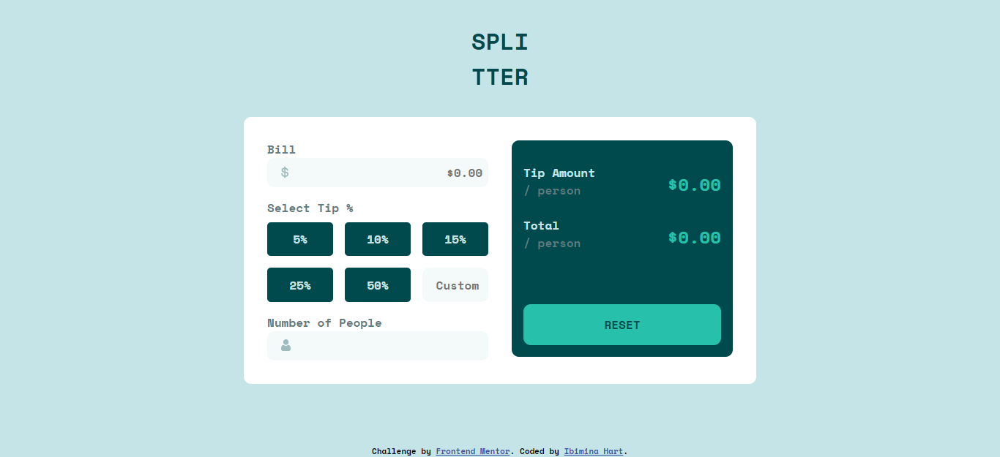
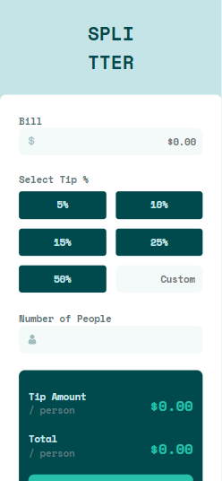

# Frontend Mentor - Tip calculator app solution

This is a solution to the [Tip calculator app challenge on Frontend Mentor](https://www.frontendmentor.io/challenges/tip-calculator-app-ugJNGbJUX). Frontend Mentor challenges help you improve your coding skills by building realistic projects.

## Table of contents

- [Overview](#overview)
  - [The challenge](#the-challenge)
  - [Screenshot](#screenshot)
  - [Links](#links)
- [My process](#my-process)
  - [Built with](#built-with)
  - [What I learned](#what-i-learned)
  - [Useful resources](#useful-resources)
- [Author](#author)

## Overview

### The challenge

Users should be able to:

- View the optimal layout for the app depending on their device's screen size
- See hover states for all interactive elements on the page
- Calculate the correct tip and total cost of the bill per person
- Added a submit buttom 
### Screenshot




### Links

- Solution URL:(https://github.com/ibimina/tip-calculator-app-main)
- Live Site URL:(https://ibimina.github.io/tip-calculator-app-main/)

## My process

### Built with

- Semantic HTML5 markup
- CSS custom properties
- Flexbox
- CSS Grid
- Mobile-first workflow

### What I learned

I used this to remove the arrow increase and decrease in input type number

```css
input[type="number"]::-webkit-inner-spin-button,
input[type="number"]::-webkit-outer-spin-button {
  -webkit-appearance: none;
  -moz-appearance: none;
  appearance: none;
}

#person {
  background-image: url(images/icon-person.svg);
  background-repeat: no-repeat;
  background-position-y: center;
  background-position-x: 1rem;
}
```

### Useful resources

- [appcode.app](https://appcode.app/how-to-remove-the-arrows-on-html-input-type-number) - This helped me to remove the arrows on he HTML input type number. I really liked this pattern and will use it going forward.

## Author

- Ibimina Hart
- Frontend Mentor - (https://www.frontendmentor.io/profile/ibimina)
- Twitter - (https://www.twitter.com/ibiminaaH)
